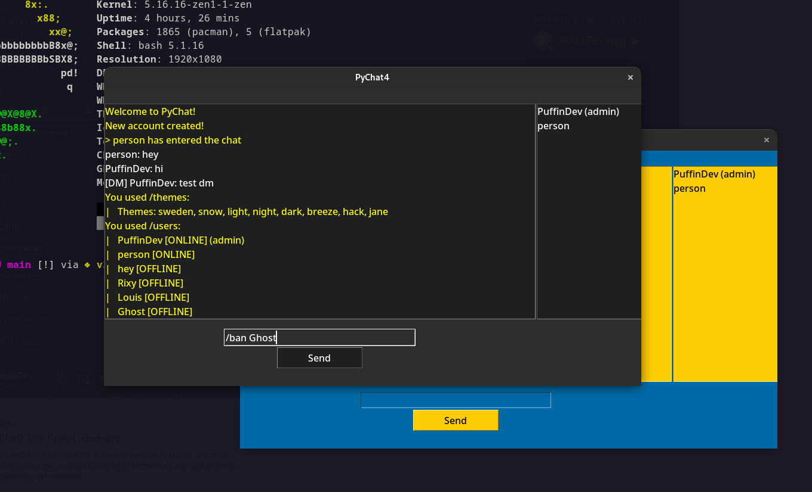

# PyChat4
PyChat is a feature rich, lightweight and customisable chatroom software written in python.

## Features

- Easy to set up and customise server
- Official server running 24/7
- Hackable codebase - make your own bots, clients and more!
- Direct messages and user accounts
- Many /commands to try out
- Ping members and roles
- Administration tools such as /ban and /kick
- Customisable client themes

## Get started

### Run the following commands to get started and connect to the official server:

`git clone https://github.com/PuffinDev/PyChat4/`

`cd PyChat4`

`python3 client.py`

Choose a username and password, and click connect.

For info on commands, type `/help` into the chat

 

### Run the following commands to run your own server:

`git clone https://github.com/PuffinDev/PyChat4 && cd PyChat4` (only run if you don't yet have pychat downloaded!)

`python3 server.py`

If you want to connect to your server from outside your local network, forward port 8888 on your router.

